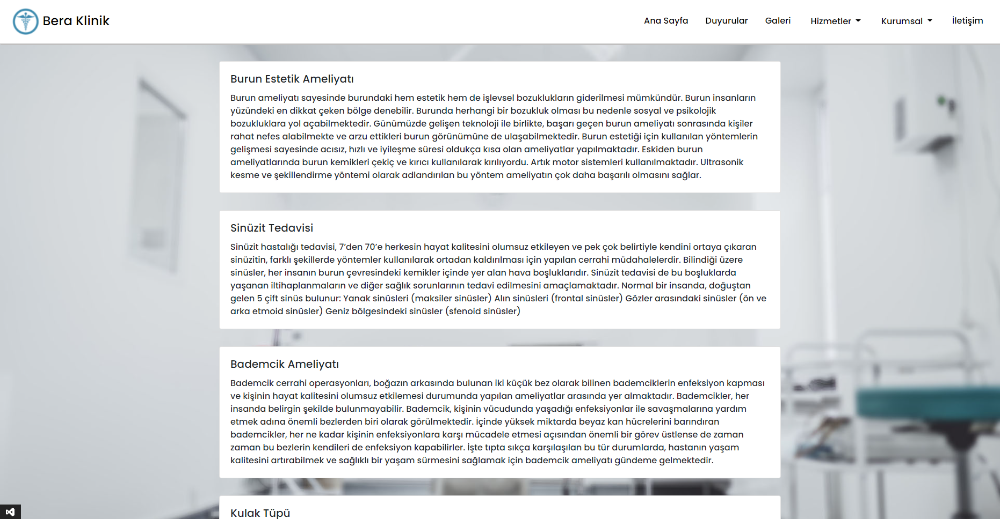

<h1>ENT-Clinic WebSite example</h1>

- This site has the features of making appointments, Admin panel and Admin login. 

 
<h2>Technologies used in the project</h2>

  </a>
    
    
      
    
    

<h3 align="left">Database :</h3>

  
<h2>Photo examples</h2>
 

  

<h2>Responsive examples</h2>

 

    
